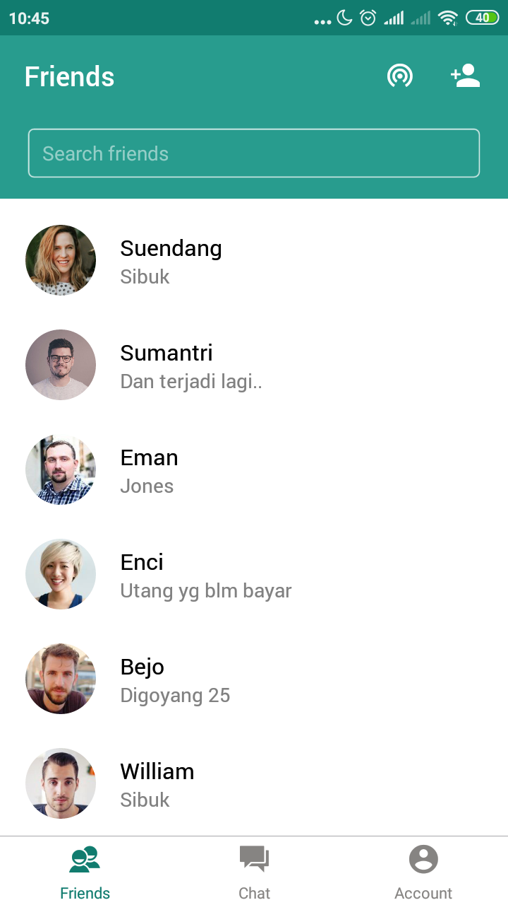
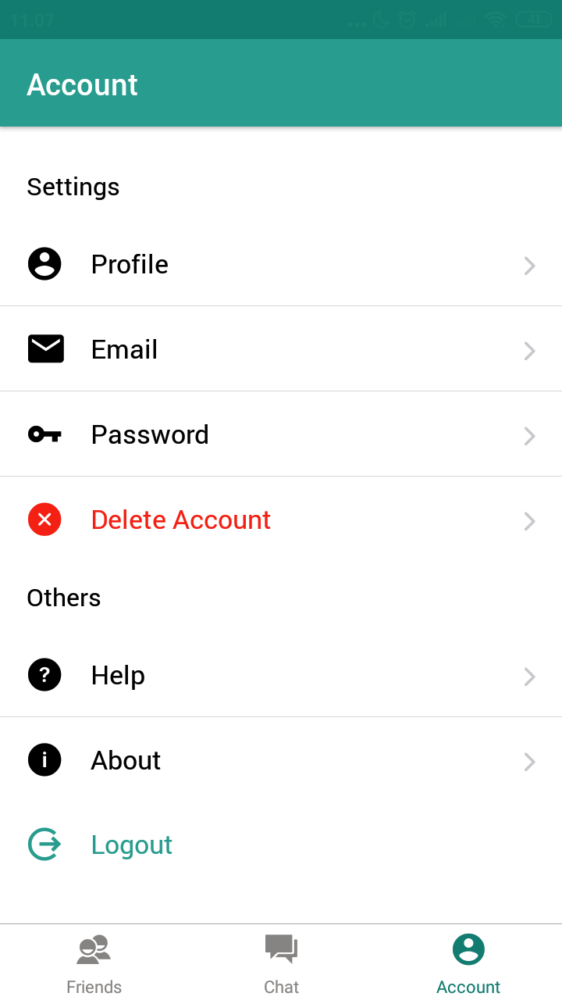
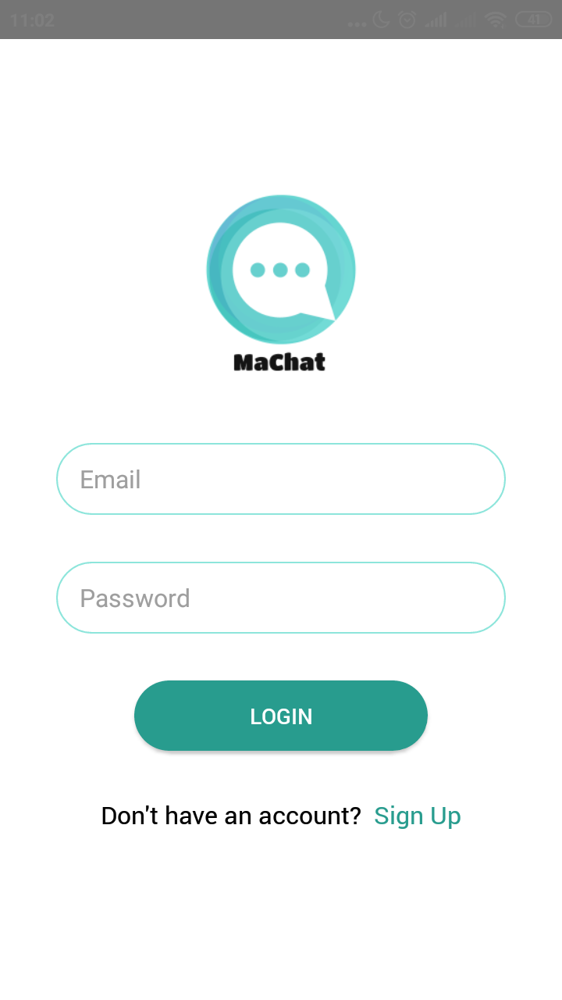
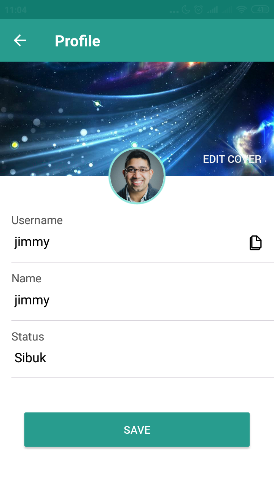
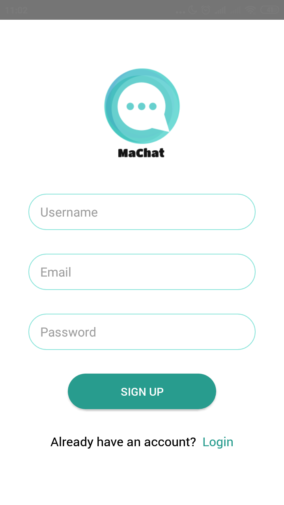
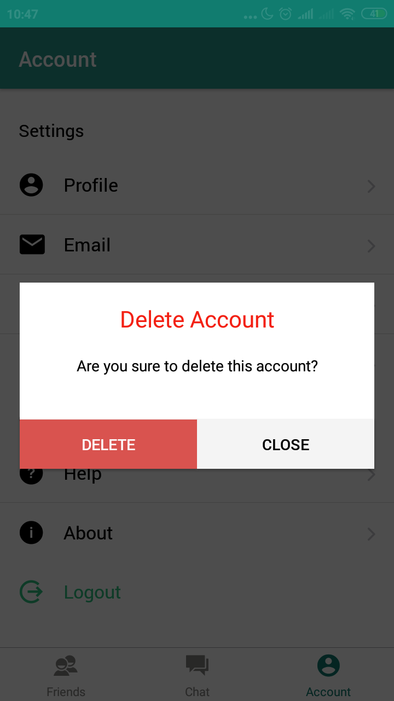
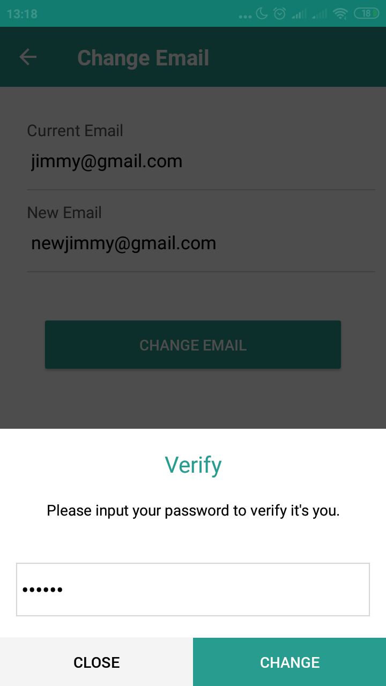

<h1 align="center">MaChat - Maps and Realtime Chat  </h1>
<p align="center">
  
</p>
<p align="center">
  Built with React Native & Firebase
</p>

## Introduction

<b>MaChat</b> is a Mobile application that can be used to chat with each other and track the location of friends in realtime.

## Features

- Sign up and sign in to use this application
- Search friend by username
- Add friend to contact
- Chat with friend
- Users can track the location of friend
- And others

## Requirements
* [Node.js](https://nodejs.org/en/)
* [Yarn](https://yarnpkg.com/lang/en/)
* [React Native](https://facebook.github.io/react-native/)

## Installation

Clone this repository and then use the package manager yarn to install dependencies.

```bash
yarn
```

## Run the app

Prepare your android device or emulator, if you're new in react native you can start with this [documentation](https://facebook.github.io/react-native/docs/getting-started)

```bash
yarn run android
```

## Create Environment Variable

Create .env file in your root project folder.

```
# Set Firebase Config
apiKey='YOUR_apiKey_FIREBASE'
authDomain='YOUR_authDomain_FIREBASE'
databaseURL='YOUR_databaseURL_FIREBASE'
projectId='YOUR_projectId_FIREBASE'
storageBucket='YOUR_storageBucket_FIREBASE'
messagingSenderId='YOUR_messagingSenderId_FIREBASE'
appId='YOUR_appId_FIREBASE'
measurementId='YOUR_measurementId_FIREBASE'
```

## Screenshots

<div align="center">
       
    
    
</div>
<div align="center">  
      
    
    
</div>
<div align="center">  
      
    
    
</div>

## Contributing
Pull requests are welcome. For major changes, please open an issue first to discuss what you would like to change.

Please make sure to update tests as appropriate.

## License
[MIT](https://choosealicense.com/licenses/mit/)
